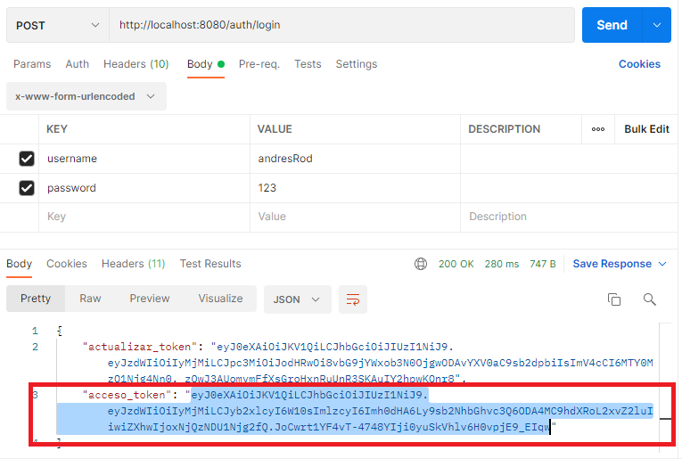

# CHALLENGE BACKEND - Java - Spring Boot (API) 🚀

### Objetivo

Desarrollar una API para explorar el mundo de Disney, la cual permitirá conocer y modificar los personajes que lo componen y entender en qué películas estos participaron. Por otro lado, deberá exponer la información para que cualquier frontend pueda consumirla. 
- 👉 Utilizar Spring Boot
- 👉 No es necesario armar el Frontend
- 👉 Las rutas deberán seguir el patrón REST
- 👉 Utilizar la librería Spring Security

### Requerimientos técnicos
## 1. Modelado de Base de Datos
**Personaje:**  deberá tener:
- Imagen.
- Nombre.
- Edad.
- Peso.
- Historia.
- Películas o series asociadas.

 **Película o Serie:**  deberá tener:
- Imagen.
- Título.
- Fecha de creación.
- Calificación (del 1 al 5).
- Personajes asociados.

**Género:** deberá tener:
- Nombre.
- Imagen.
- Películas o series asociadas.

## 2. Autenticación de Usuarios
El usuario despues de registrarse y logearse, obteniene un token, el cual es necesario y requerido para acceder a los demás paths, una vez que pasa 10 minutos el token queda desactualizado o vencido, lo que obliga a que el usuario vuelva a generarlo mediante un nuevo login.
Para desactivar el pedido de token y login en los paths es necesario comentar la linea 44 y 48 de la clase llamada SecurityConfig (.authenticated();) y sacar el comentario a la linea 46 del mismo (.permitAll();)

### POST (registro)
	http://localhost:8080/auth/register

Ejemplo:

    {        
        "nombreCompleto": "andres Rodriguez",
        "email": "andres_rod_000@hotmail.com",
        "username": "andresRod",
        "contrasenia": "123"
    }

### POST (login)
	http://localhost:8080/auth/login

Ejemplo login:

Ejemplo de path usando el token generado por el login:

## 3. Listado de Personajes

Con el siguiente endpoint se muestra los personajes, pero solamente se filtra a traves de un DTO los datos de: imagen y nombre.

### GET
	http://localhost:8080/characters/

## 4. Personajes (CRUD)

### POST
	http://localhost:8080/crearPersonaje/

Ejemplo:

    {
    "imagen": "urlImg",
    "nombre": "roberto carlos",
    "peso": 120.5,
    "edad": 23,
    "historia": "historia1"    
    }

### PUT by ID
	http://localhost:8080/modificarPersonaje/{id}

### DELETE by ID
	http://localhost:8080/borrarPersonaje/{id}

## 5. Personaje detalle

En el detalle se alistan todos los atributos del personaje, como así también sus películas relacionadas.

### GET By ID
	http://localhost:8080/detallePersonaje/{id}

## 6. Búsqueda de Personajes

Busqueda por nombre:

    http://localhost:8080/characters?name={nombre}

Busqueda por Edad:

    http://localhost:8080/characters?age={edad}

Busqueda por Peso:

    http://localhost:8080/characters?weight={peso}

Busqueda por Pelicula asociada:

    http://localhost:8080/characters?movies={idPelicula}

## 7. Listado de Películas

Muestra solamente a traves de un Dto los campos imagen, título y fecha de creación.

    http://localhost:8080/movies/

## 8. Detalle de Película / Serie con sus personajes

Devuelve todos los campos de la película o serie junto a los personajes asociados a la misma.
(Debido a la relación many to many bidireccional con Personajes y para evitar Recursión infinita se utilizo la anotación @JsonIdentityInfo)

    http://localhost:8080/detallePelicula/{idPelicula}

## 9. Película / Serie CRUD

### POST
	http://localhost:8080/crearPelicula/

Ejemplo:

    {    
    "imagen": "urlImg",
    "titulo": "Spiderman",    
    "calificacion": 5    
    }

### PUT by ID
	http://localhost:8080/modificarPelicula/{id}

### DELETE by ID
	http://localhost:8080/eliminarPelicula/{id}

## 10.Búsqueda de Películas o Series

Busqueda por Titulo o nombre:

    http://localhost:8080/movies?name={titulo}

Filtro por Género:
    
    http://localhost:8080/movies?genero={género}

Ordenar los resultados por fecha de creación de forma ascendiente o descendiente:

    http://localhost:8080/movies?order={ASC | DESC }

## 11. Envío de emails

Para el envío de mail se utilizó el Servicio [SendGrid](https://app.sendgrid.com/ "SendGrid").
Mediante el cual, cuando un usuario se registra (http://localhost:8080/auth/register) se envía un email con un mensaje de Bienvenida al correo registrado. El mail es enviado desde mi cuenta personal registrada en el sitio indicado (SendGrid), mediante una API KEY que valida los enviós de mails.

## 12 PATH ADICIONALES

### A. GENEROS:

### POST (crear)
	http://localhost:8080/generos

Ejemplo:

    {
        "imagen": "url3",
        "nombre": "comedia romantica"
    }
    
### GET (Mostrar generos)

    http://localhost:8080/generos

### DELETE by ID

    http://localhost:8080/generos/{id}

### PUT by ID

    http://localhost:8080/generos/{id}

### B. PELICULAS:

### POST by ID (agregar personaje a pelicula)

    http://localhost:8080/movies/idPelicula/{idPel}/idPersonaje/{idPers]

### POST by ID (agregar genero a pelicula)

    http://localhost:8080/movies/idPelicula/{idPel}/idGenero/{idGen}

## 13 DOCUMENTACION

Fueron documentados los endpoints utilizando Postman, el archivo json correspondiente al mismo fue agregado al proyecto con el nombre: Coleccion Alkemi Challenge.postman_collection.json

## 14 TESTS

- Tests verificando posibles erroes usando herramientas como JUnit y Mockito. REPOSITORY Y SERVICE: Testeado totalmente capas correspondientes a Genero. 

## 15 PENDIENTES:

- CREAR ROLES Y AGREGARLOS A USUARIOS: De manera que el usuario puede realizar determinada tarea según su rol.

